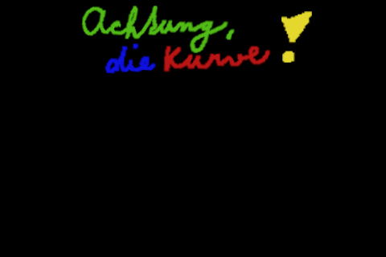

# Semestrální práce z předmětu APO na oboru Kybernetika a Robotika

- [Semestrální práce z předmětu APO na oboru Kybernetika a Robotika](#semestrální-práce-z-předmětu-apo-na-oboru-kybernetika-a-robotika)
  - [Achtung die Kurve!](#achtung-die-kurve)
  - [Instalce závislostí](#instalce-závislostí)
  - [Kompilace](#kompilace)
  - [Spuštění](#spuštění)
    - [Ovládání hry](#ovládání-hry)
  - [Cíle makefile](#cíle-makefile)
    - [Dokumentace](#dokumentace)

## Achtung die Kurve!
Jde o implementaci hry Achtung die Kurve! v jazyce C pro školní vývojovou desku. Součástí implementace je emulace na PC, kde je možné hru ovládat klávesnicí.



## Instalce závislostí

Před spuštěním projektu je nutné nainstalovat všechny závislosti. To lze provést pomocí následujícího příkazu:

```bash
./tools/install_dependencies.sh
```

> [!note]
> Nebo ručně podle souboru `dependencies.txt`

Make byl rozšířen o cíl `install`, který spustí skript pro instalaci závislostí. Pro instalaci závislostí tedy stačí spustit následující příkaz:
```bash
make install
```

## Kompilace

Pro kompilaci projektu použijte následující příkaz:

```bash
make
```

## Spuštění

Pro spuštění emulace na PC použijte následující příkaz:

```bash
make run
```

nebo:
```bash
./build/aposem-main
```

### Ovládání hry

Rotace knoflíků je emulovaná pomocí klávesnice:

Levý knoflík:
- D 
- F
  
Pravý knoflík:
- J
- K

## Cíle makefile

```txt
Usage: make [target]
Targets:
  all       - Build the project and install dependencies
  install   - Install dependencies
  docs      - Generate documentation using Doxygen
  zip       - Create a zip archive of the project
  clean     - Remove build artifacts and documentation
  run       - Build and run the project
  help      - Show this help message
```

### Dokumentace

Dokumentace je generována pomocí Doxygenu. Pro její vygenerování použijte následující příkaz:

```bash
make docs
```